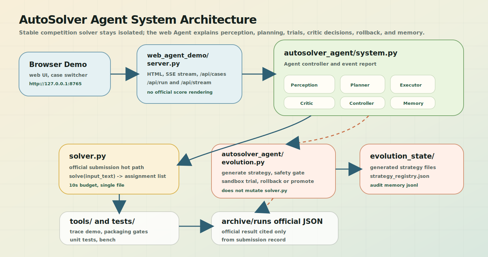
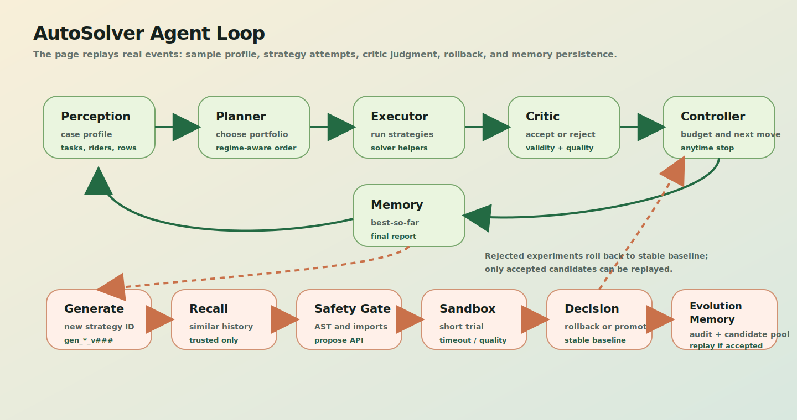
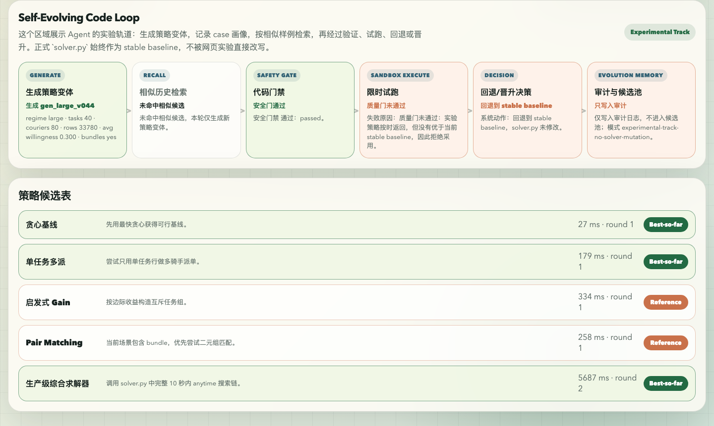
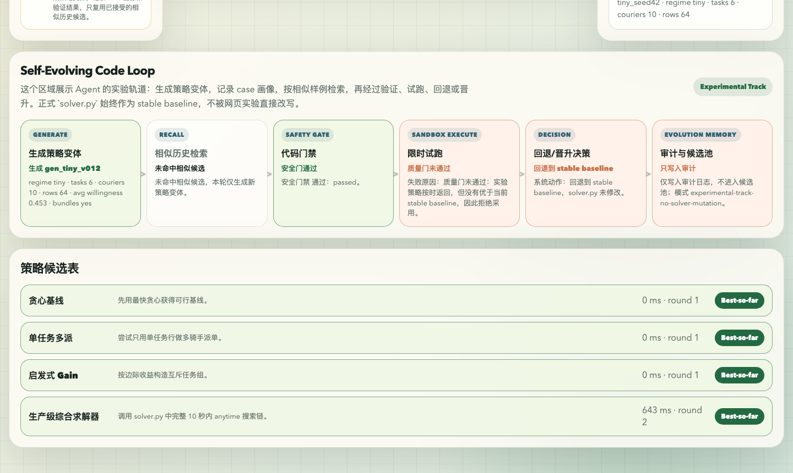
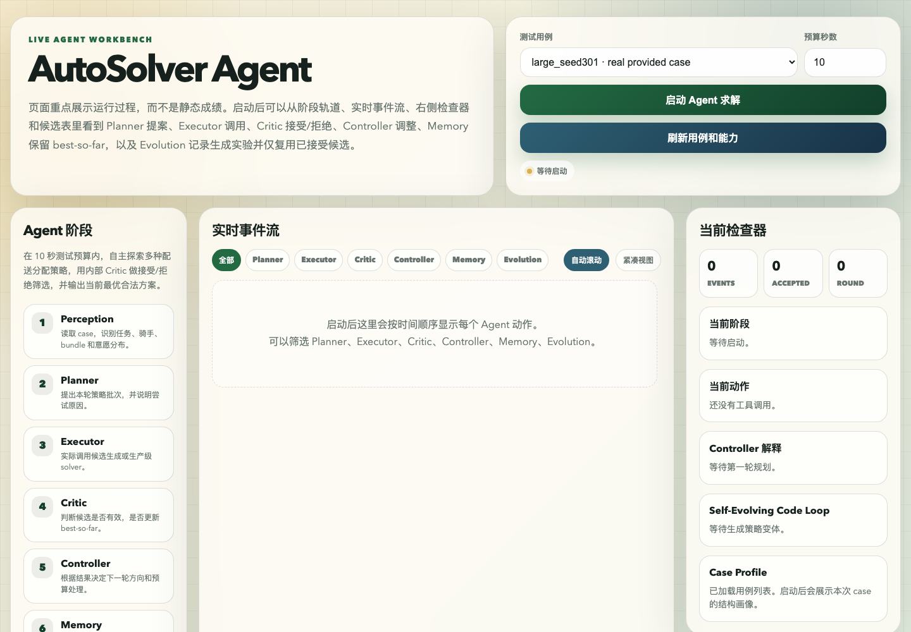
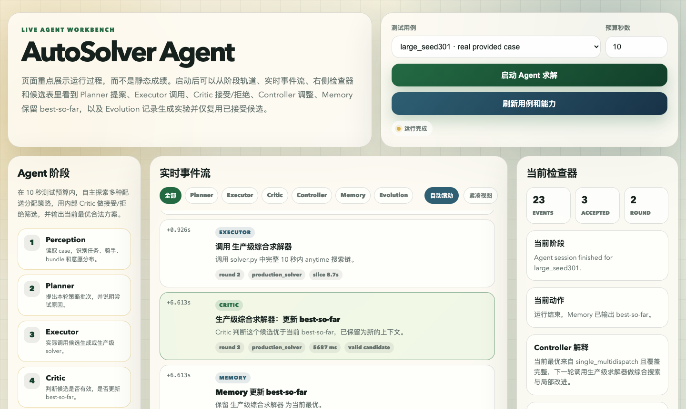
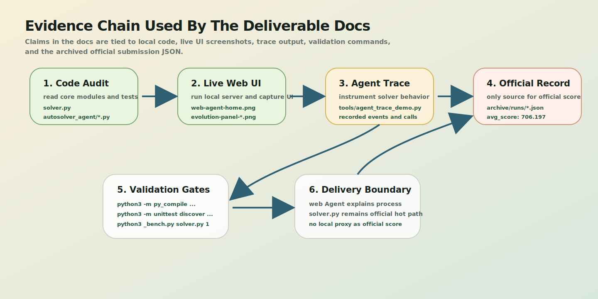

# AutoSolver Agent 项目文档

## 1. 项目概述

本项目面向美团 AI Hackathon 命题四 AutoSolver，目标是在有限时间内为随机配送分配问题输出合法且低期望成本的当前最优方案。系统采用“正式求解器 + 网页端 Agent”的双层架构：`solver.py` 保持稳定、可提交、可复核；网页端 Agent 展示 regime-aware planning、critic-driven selection、anytime control 和 self-evolving strategy loop。

当前提交版包含两部分：

| 部分 | 入口 | 定位 |
|---|---|---|
| 正式比赛求解器 | `solver.py` | 官方评测时实际执行的求解入口，单文件、无第三方依赖、保留 `solve(input_text: str) -> list` 接口。 |
| 网页端 Agent 系统 | `web_agent_demo/server.py` | 答辩和项目说明入口，用实时事件流展示 Agent 的感知、规划、执行、评估、回退和记忆。 |

正式比赛链路保持最小化。评测系统调用 `solver.py` 后，只需要得到合法分配结果：

```text
input_text -> solver.py:solve() -> list[tuple[str, list[str]]]
```

网页 Agent 展示链路用于说明系统能力，不进入正式评测链路：

```text
Browser -> web_agent_demo/server.py -> autosolver_agent/system.py -> solver.py helpers / solver.py:solve()
```

自进化实验链路用于验证“策略生成 -> 安全门 -> 沙箱试跑 -> 回退/晋升 -> 候选沉淀”的闭环：

```text
case_profile -> generate strategy -> safety gate -> sandbox trial -> decision -> evolution memory
```

### 1.1 阅读说明

为便于技术评审对照代码与页面，本文档采用以下命名约定：

- `solver.py` 是正式评测求解入口。
- `web_agent_demo/` 与 `autosolver_agent/` 构成网页端 Agent 展示系统。
- `Critic`、`Controller`、`Memory` 分别对应评估器、控制器和记忆模块。
- `Self-Evolving Code Loop` 对应自进化实验轨道。
- `case profile`、`regime`、`best-so-far` 在正文中分别写作样例画像、规模类型和当前最优解。
- `trace` 在正文中写作运行追踪，仅用于证明系统行为，不作为官方成绩。

## 2. 需求对齐

本项目按最终评审可检查的工程能力组织如下：每项能力都对应明确代码位置和可复核证据。

### 2.1 不只是一个求解器

- 工程实现：`solver.py` 负责正式比赛输出，`autosolver_agent/` 负责 Agent 控制、事件回放和决策解释。
- 代码位置：`solver.py`、`autosolver_agent/system.py`。
- 证据：架构图、页面截图和浏览器实时事件流。

### 2.2 自主探索策略

- 工程实现：Planner 基于规模类型和样例画像组织 regime-aware portfolio。
- 代码位置：`_initial_strategies()`、`_adaptive_strategies()`。
- 证据：`round_start` 事件和页面策略候选表。

### 2.3 自动评估与筛选

- 工程实现：评估器（Critic）执行合法性校验、相对质量比较和 best-so-far 更新。
- 代码位置：`_solution_record()`、`summarize_solution()`。
- 证据：`attempt_result`、`best_update` 和页面接受/拒绝状态。

### 2.4 迭代改进循环

- 工程实现：控制器（Controller）根据上一轮结果调整下一轮策略、时间片和回退动作。
- 代码位置：`run_agent()` 主循环。
- 证据：`adapt`、`budget` 事件和控制器解释。

### 2.5 输出当前最优解

- 工程实现：记忆模块（Memory）始终保留当前最优解，预算截止时输出当前最优合法解。
- 代码位置：最终报告中的 `best` 和 `solution`。
- 证据：页面当前检查器和最终报告。

### 2.6 持续自我进化

- 工程实现：系统生成实验策略，经过安全门、沙箱试跑、回退/晋升后写入候选记忆。
- 代码位置：`autosolver_agent/evolution.py`。
- 证据：自进化动态面板和审计日志。

### 2.7 文档和技术报告

- 工程实现：用截图、架构图、运行追踪、测试和官方记录支撑论述。
- 代码位置：`docs/`、`tools/agent_trace_demo.py`。
- 证据：`docs/assets/` 中的截图、架构图和证据链图。

本文档从三条主线说明项目：正式求解质量、Agent 自主迭代能力、技术证据与交付可复核性。成绩口径以官方最终评测和官方提交记录为准，本文档不使用本地指标替代官方成绩。

运行层面，Agent 最终报告会记录本次策略尝试、评估器决策、迭代调整、自进化实验和最终当前最优解输出。网页端重点展示实时 Agent 行为，让评委能看到从 perception 到 memory 的完整控制流，而不是只阅读静态描述。

## 3. 架构总览

下图展示正式求解器、网页 Agent、自进化实验轨道和证据工具之间的边界。架构设计的核心原则是：正式评测链路保持 deterministic and minimal，Agent 展示链路负责解释、审计和实验。



关键边界：

- `solver.py` 不依赖网页前端，也不读取自进化记忆区。
- `autosolver_agent/` 可以调用 `solver.py` 作为稳定基线。
- 生成策略只在实验轨道运行，不自动改写 `solver.py`，避免实验代码污染正式评测链路。
- 页面展示只解释 Agent 决策，不把本地评估成本当作官方成绩。
- 官方成绩只引用 `archive/runs/official_submit_20260520_132026_70222083.json`。

## 4. 目录结构

| 路径 | 作用 |
|---|---|
| `solver.py` | 正式比赛唯一提交文件，保留完整组合求解链和局部改进逻辑。 |
| `autosolver_agent/system.py` | Agent 控制器，负责感知、规划、策略试跑、评估、事件流和最终报告。 |
| `autosolver_agent/evolution.py` | 自进化实验管理器，负责生成策略、安全门、沙箱试跑、回退和记忆。 |
| `autosolver_agent/evolution_state/` | 自进化实验的运行态审计文件、生成策略和候选策略注册表，由网页 Agent 运行时自动创建。 |
| `web_agent_demo/server.py` | 本地网页服务，负责页面 HTML、实时事件流、样例列表和用户交互。 |
| `web_agent_demo/sample_cases.py` | 演示样例生成和样例列表管理。 |
| `tools/agent_trace_demo.py` | 生成函数级运行追踪，用于证明策略调用、改进器调用和记忆模块调用。 |
| `tools/render_lineage.py` | 将运行追踪 JSON 渲染为 Graphviz DOT。 |
| `tools/make_submission.py` | 生成交付包并执行基础 gate。 |
| `tests/` | 单元测试、Agent 能力测试、页面测试和打包测试。 |
| `data/official_cases/` | 项目内保留的官方提供样例数据。 |
| `archive/runs/official_submit_20260520_132026_70222083.json` | 官方提交记录。评审正文只引用该官方记录，不引用本地页面分数。 |
| `docs/assets/` | 本文档引用的架构图、证据链图和前端截图。 |

## 5. Agent 闭环

下图展示 Agent 的运行闭环。上半部分是求解闭环，下半部分是自进化实验轨道。整体结构对应 Perception、Planner、Executor、Critic、Controller、Memory 六类职责分离。



### 5.1 Perception

代码位置：`autosolver_agent/system.py`。

Perception 负责解析输入候选行，统计任务数、骑手数、候选行数、平均接单意愿和是否存在合单，并调用 `tools.agent_trace_demo.infer_regime` 推断规模类型。该步骤相当于对实例做 feature extraction，为后续策略路由提供上下文。

`large_seed301` 的实际样例画像：

```json
{
  "regime": "large",
  "tasks": 40,
  "couriers": 80,
  "rows": 33780,
  "avg_willingness": 0.299973,
  "has_bundles": true
}
```

### 5.2 Planner

代码位置：`autosolver_agent/system.py`。

Planner 的策略分两层：

| 阶段 | 函数 | 作用 |
|---|---|---|
| 初始探索 | `_initial_strategies(regime)` | 为每个样例安排基础策略集合。 |
| 自适应补充 | `_adaptive_strategies(...)` | 根据当前最优解、覆盖率和规模类型决定下一轮搜索方向。 |

策略目录来自 `get_agent_blueprint()`，包括贪心、多派、二元匹配、稀疏覆盖、低意愿列搜索、稀缺骑手列搜索、流模型和生产级综合求解器。Planner 不是固定顺序调用算法，而是根据 regime 和当前覆盖状态进行 adaptive dispatch。

### 5.3 Executor

代码位置：`autosolver_agent/system.py` 和 `solver.py`。

Executor 负责运行具体策略。常见策略函数包括：

| 函数 | 说明 |
|---|---|
| `_fallback_official_greedy` | 快速贪心基线。 |
| `_solve_single_task_multidispatch` | 单任务多骑手派单。 |
| `_solve_disjoint_then_multidispatch` | 互斥任务组构造和多派补强。 |
| `_solve_pair_potential_matching` | 二元匹配策略。 |
| `_solve_sparse_cover` | 稀疏覆盖搜索。 |
| `_solve_low_global_column_search` | 低意愿全局列搜索。 |
| `_solve_scarce_k2_column_search` | 稀缺骑手二任务组合列搜索。 |
| `_solve_scarce_bundle_mcf_enum` | 稀缺场景 bundle 流模型枚举。 |
| `solve` | 生产级完整求解链。 |

### 5.4 Critic（评估器）

代码位置：`autosolver_agent/system.py`、`tools/agent_trace_demo.py`、`solver.py`。

Critic 是系统评估器，做三类判断：

| 判断 | 含义 |
|---|---|
| 合法性 | 检查输出格式、重复任务、重复骑手、未覆盖任务等。 |
| 相对质量 | 使用本地 `_solution_expected_cost` 做候选相对筛选。 |
| 接受规则 | 只有合法且优于当前最优解的候选才更新最优。 |

本地评估器的结果只解释 Agent 决策，不等同于官方分数。它对应 critic-driven filtering：候选策略必须经过合法性与相对质量判断，不能只因为被生成就进入最终输出。

目标函数在本文档中只用于说明问题约束和本地评估器的相对择优边界，不作为官方成绩。评估维度如下：

| 指标 | 工程含义 | 文档边界 |
|---|---|---|
| 完成概率 | 一个任务被派给一个或多个骑手后，至少一人接单的概率。 | 用于解释为什么多派和合单可能改变方案质量。 |
| 期望成本 | 按接单意愿和候选 score 估计的本地相对成本。 | 用于评估器比较候选，不等同于官方最终分数。 |
| 未覆盖惩罚 | 未被有效覆盖的任务会降低方案质量。 | 用于解释稀疏覆盖、匹配和综合求解器的覆盖优先级。 |
| 时间预算 | 每个样例需要在有限时间内返回当前最优合法解。 | 用于解释当前最优解和控制器截止策略。 |

### 5.5 Controller（控制器）

代码位置：`autosolver_agent/system.py`。

Controller 是系统控制器，负责管理总预算 `budget_s`，给每个策略分配短时间片，接近截止时间时停止新策略试跑，并保留当前最优解。所有候选失败时，控制器回退到生产级综合求解器或当前稳定基线。这一层保证系统具备 anytime behavior：任意时刻都能返回已知最优合法候选。

时间约束采用两层理解：

| 时间口径 | 工程含义 |
|---|---|
| 2-5 秒内输出当前最优方案 | 系统应尽早产生可行候选，不能等到全部实验结束才有输出。 |
| 每个样例 10 秒求解预算 | 正式评测链路按 10 秒内返回，Agent 控制器也以 `budget_s` 管理策略试跑。 |

因此当前实现优先保证先产生合法可行解，再利用剩余预算做多策略搜索和局部改进。

### 5.6 Memory（记忆模块）

Memory 是记忆模块，分为两类：

| 类型 | 位置 | 作用 |
|---|---|---|
| 求解器内置记忆 | `solver.py` 中的 cache / output upgrade 函数 | 固化经过守卫条件保护的历史验证结构。 |
| 自进化记忆区 | `autosolver_agent/evolution_state/` | 记录生成策略、试跑结果、相似样例画像和候选状态。 |

## 6. 正式求解器算法主线

代码位置：`solver.py`。

这一节补充正式比赛求解链路如何得到方案。它与网页 Agent 展示链路不同：`solver.py` 是官方提交入口，不读取自进化记忆区，不动态加载生成策略，也不依赖网页服务。网页 Agent 可以调用它作为稳定基线，但正式评测时只需要 `solve(input_text: str) -> list`。

### 6.1 输入解析与候选建模

`solve()` 首先解析输入文本，构造任务、骑手、候选行和 bundle 信息。每条候选行可以抽象为：

```text
task_key / courier_group / task_id / willingness / score / extra_flags
```

随后求解器根据任务数、骑手数、候选行数、平均接单意愿、是否存在合单等信息判断样例类型，例如 large、scarce、low-willingness 或普通中小规模场景。这个规模类型决定后续多策略组合中哪些策略优先执行。

### 6.2 快速基线与可行解兜底

正式求解链路不会等复杂搜索结束才产生输出。`_fallback_official_greedy()`、单任务多派和基础贪心修复会尽早构造合法候选解，作为后续搜索的兜底基线。若复杂策略超时或没有改进，系统仍可返回当前最优解。这是 `solver.py` 的 anytime safety net。

### 6.3 多策略组合搜索

`solve()` 会按样例画像组合多类策略，而不是固定调用一种算法。整体可以视为一个 lightweight portfolio solver：先用低成本启发式保证可行性，再用列搜索、匹配、流模型和局部改进争取质量增益。

| 策略族 | 代表函数 | 适用目的 |
|---|---|---|
| 贪心与多派 | `_fallback_official_greedy`、`_solve_single_task_multidispatch` | 快速得到可行解，并提高低意愿任务完成概率。 |
| 互斥组合与匹配 | `_solve_disjoint_then_multidispatch`、`_solve_pair_potential_matching` | 在 bundle 或二元组合明显时寻找更优任务组。 |
| 稀疏覆盖 | `_solve_sparse_cover` | 资源紧张或覆盖不足时优先保证任务覆盖。 |
| 低意愿列搜索 | `_solve_low_global_column_search` | 面向低接单概率场景构造全局候选列。 |
| 稀缺骑手列搜索 | `_solve_scarce_k2_column_search` | 面向骑手稀缺场景搜索二任务组合列。 |
| 稀缺 bundle 流模型 | `_solve_scarce_bundle_mcf_enum` | 在小规模稀缺场景中枚举并重组 bundle 分配。 |

这些策略产生多个候选解后，求解器用 `_solution_expected_cost()` 做本地相对成本比较，保留当前最优候选。

### 6.4 局部改进与 exact-cost 择优

得到初始候选后，`solver.py` 会在剩余时间内做局部改进，包括：

| 改进方向 | 代表函数 |
|---|---|
| 单任务重分配与负载均衡 | `_reassign_single_solution`、`_rebalance_single_solution` |
| 混合结果重分配 | `_reassign_mixed_solution` |
| bundle 合并、拆分和重连 | `_local_improve_mixed_solution`、`_improve_single_pair_merges`、`_improve_pair_rewires` |
| 稀缺场景修复和 polish | `_scarce_polish_candidate`、`_scarce_eject_extra_to_uncovered` |

每次改进都以精确本地成本或覆盖不退化为守卫，只有更优候选才会替换当前最优解。该机制相当于在有限时间内执行 guarded local search，降低策略组合带来的退化风险。

### 6.5 Cache / Output Upgrade 守卫

`solver.py` 中保留了若干历史验证结构和输出升级函数，例如 `_small_seed100_cached_solution()`、`_scarce_seed401_cached_solution()`、`_large302_output_upgrade()`。文档只描述它们的机制：这些逻辑必须满足严格画像和输入条件才会触发，未命中时仍回到实时搜索链路。

这些函数不表示对所有官方实例都必然触发。正式评测样例可能发生变化，因此当前文档只把 cache / upgrade 解释为受保护的历史经验沉淀，而不是替代实时求解的捷径。

### 6.6 限时输出边界

正式求解器围绕截止时间运行，策略和局部改进中会检查剩余时间。设计目标是在每个样例 10 秒预算内返回当前最优合法解：先有可行基线，再用剩余时间组合搜索、局部改进和精确成本择优。

## 7. Self-Evolving Code Loop（自进化实验轨道）

代码位置：`autosolver_agent/evolution.py`。

`EvolutionManager` 是自进化管理器，负责管理生成策略实验，但不修改 `solver.py`。它的目标不是把失败策略塞进正式求解链路，而是在可控轨道中生成、验证、试跑、回退或沉淀候选。

这一部分对应 AutoSolver Agent 的“持续自我进化”能力：系统可以生成实验策略变体，通过静态安全门和动态沙箱试跑筛选候选；失败策略进入审计日志，成功策略进入候选池。该设计把 strategy generation 与 production solver 隔离，避免错误经验污染后续样例。

核心类：

| 类 | 作用 |
|---|---|
| `GeneratedStrategy` | 描述生成策略 ID、路径、目标规模类型和来源。 |
| `SafetyResult` | 描述安全门是否通过和拒绝原因。 |
| `TrialOutcome` | 描述沙箱试跑结果、接受状态、耗时和本地评估成本。 |
| `EvolutionManager` | 统一管理生成、校验、试跑、注册表和记忆文件。 |

安全门约束：

- 允许少量标准库 import，例如 `collections`、`heapq`、`itertools`、`math`、`random`、`time`。
- 禁止 `eval`、`exec`、`compile`、`open`、`__import__` 等危险调用。
- 禁止 `os`、`pathlib`、`socket`、`subprocess`、`sys` 等根对象属性调用。
- 要求生成策略提供固定接口 `propose(candidates, all_tasks, deadline, helpers)`。

试跑结果解释：

| 结果 | 含义 | 后续动作 |
|---|---|---|
| `timeout` | 沙箱窗口内未返回 | 回退稳定基线，只写审计。 |
| `invalid output format` | 返回格式不符合接口要求 | 回退稳定基线，只写审计。 |
| `quality regression` | 按时返回且合法，但没有优于稳定基线 | 回退稳定基线，只写审计。 |
| 安全门失败 | 未通过 AST、import 或接口检查 | 不进入 Sandbox，只写审计。 |
| accepted / promoted | 试跑通过且可复用 | 写入候选池，后续相似样例可复用。 |

下面两张截图展示了不同样例下的动态自进化面板。





## 8. 网页数据流

### 8.1 页面启动

下图是页面启动后的初始状态，能看到样例选择、预算输入、启动按钮、Agent 阶段轨道、实时事件流和当前检查器。



```text
用户打开 http://127.0.0.1:8765
-> web_agent_demo/server.py 渲染页面
-> list_cases() 枚举 data/official_cases 与 web_agent_demo/generated_cases
-> 用户选择样例
-> 浏览器事件流调用 run_case_agent()
-> autosolver_agent/system.py 发送实时事件
-> 页面动态更新策略、评估器和自进化面板
```

### 8.2 Agent 求解

```text
输入文本
-> parse_candidates()
-> infer_regime()
-> _initial_strategies()
-> run strategy
-> _solution_record()
-> accept / reject
-> _adaptive_strategies()
-> EvolutionManager.generate_strategy()
-> safety_check()
-> run_generated_strategy()
-> promote / rollback
-> final report
```

可以抽象为 AutoSolver Agent 的核心闭环：

```text
自主生成策略 -> 自动评估 -> 迭代改进 -> 记忆沉淀 -> 回退/晋升 -> 输出当前最优解
```

### 8.3 页面运行证据

下图是 `large_seed301` 运行完成后的页面状态，事件流显示执行器、评估器和记忆模块的动作，右侧检查器显示当前阶段和统计。



## 9. 运行追踪证明

`tools/agent_trace_demo.py` 会在不改变求解逻辑的前提下加载 `solver.py`，记录一次运行中真实发生的策略调用、改进器调用、记忆模块调用和评估器评估次数。

运行命令：

```bash
python3 tools/agent_trace_demo.py data/official_cases/large_seed301.txt --json-output /tmp/autosolver_trace.json --markdown /tmp/autosolver_trace.md
```

`large_seed301` 的运行追踪会记录以下信息：

```text
规模类型
运行耗时
候选方案合法性
评估器调用次数
策略/改进器/记忆模块调用链
记录到的事件数量
```

运行追踪只用于证明系统确实执行了多策略探索、局部改进、记忆调用和自动评估。正文不把本地 proxy score、覆盖数或页面 cost 展示为正式成绩。

实际调用到的策略和模块：

| 类别 | 调用 |
|---|---|
| Strategy | `_fallback_official_greedy`、`_random_single_start_solution`、`_solve_pair_potential_matching`、`_solve_single_task_multidispatch` |
| Improver | `_improve_single_pair_merges`、`_local_improve_mixed_solution`、`_reassign_mixed_solution`、`_reassign_single_solution`、`_rebalance_single_solution` |
| Memory | `_large302_output_upgrade`、`_scarce_seed401_cached_solution`、`_small_seed100_cached_solution` |

## 10. 证据链

下图说明本文档中的主要判断如何被代码、截图、运行追踪、测试和官方记录支撑。



- **模块边界**：`solver.py`、`autosolver_agent/*.py`、`web_agent_demo/server.py`，证明正式求解器和网页 Agent 分离。
- **页面截图**：`docs/assets/web-agent-home.png`、`docs/assets/web-agent-large-run.png`，证明前端可以本地跑起来并展示实时运行结果。
- **动态自进化截图**：`docs/assets/evolution-panel-large.png`、`docs/assets/evolution-panel-tiny.png`，证明面板随样例变化，而不是固定说明图。
- **运行追踪**：`/tmp/autosolver_trace.md`、`tools/agent_trace_demo.py`，证明求解链中确实发生策略、改进器、记忆模块和评估器调用。
- **测试体系**：`tests/`，覆盖 Agent 能力、自进化实验、Web 页面、求解器和打包逻辑。
- **官方记录**：`archive/runs/official_submit_20260520_132026_70222083.json`，正式结果只引用官方提交记录。

## 11. 测试体系

当前测试覆盖：

| 测试类别 | 文件 |
|---|---|
| Agent 能力 | `tests/agent_capabilities/test_cap1_exploration.py` 到 `test_cap4_anytime_and_packaging.py` |
| 自进化实验 | `tests/test_agent_evolution.py` |
| Web 页面 | `tests/test_web_agent_demo.py` |
| 求解器基础能力 | `tests/test_main.py`、`tests/test_end_to_end.py`、`tests/test_submission.py` |
| 评估一致性 | `tests/test_accurate_evaluator.py`、`tests/test_evaluator_consistency.py`、`tests/test_objective_consistency.py` |
| 算法模块 | `tests/test_candidate_gen.py`、`tests/test_controller_lns.py`、`tests/test_greedy_state.py`、`tests/test_validator.py` 等 |

验证命令：

```bash
python3 -m py_compile solver.py autosolver/*.py autosolver_agent/*.py web_agent_demo/server.py tools/*.py _bench.py
python3 -m unittest discover -s tests -p 'test_*.py'
python3 _bench.py solver.py 1
python3 tools/make_submission.py --output submission_final
git diff --check
```

交付验证口径：

- Python 编译检查用于确认主要脚本没有语法错误。
- 单元测试用于覆盖 Agent、自进化实验、Web、求解器和打包逻辑。
- `_bench.py solver.py 1` 用于复核正式求解器在单样例 10 秒预算下可以返回。
- `make_submission.py` 用于复核交付包生成链路和必要文件复制。
- Markdown、PNG 和 SVG 引用需要指向真实文件，保证文档中的图片和证据可以打开。

## 12. 交付方式

生成交付包：

```bash
python3 tools/make_submission.py --output submission_final
```

交付生成工具会复制：

- `solver.py`
- `README.md`
- `docs/README.md`
- `docs/PROJECT_STRUCTURE.md`
- `docs/ARCHIVE_INDEX.md`
- `docs/deliverables/产品说明文档.md`
- `docs/deliverables/项目文档.md`
- `docs/deliverables/作品简介.md`
- `docs/assets/architecture-overview.svg`
- `docs/assets/agent-loop.svg`
- `docs/assets/verification-evidence.svg`
- `docs/assets/web-agent-home.png`
- `docs/assets/web-agent-large-run.png`
- `docs/assets/evolution-panel-large.png`
- `docs/assets/evolution-panel-tiny.png`
- `archive/runs/official_submit_20260520_132026_70222083.json`
- 可选的 Agent 展示、工具和测试文件

其中产品说明文档、项目文档和作品简介会随交付包一起复制。

`submission_final/` 是输出目录，不是源代码编辑入口。

## 13. 官方结果引用

正式结果只引用官方提交 JSON：

```text
archive/runs/official_submit_20260520_132026_70222083.json
```

该记录中的关键字段：

```text
avg_score: 706.197
case_count: 10
success_count: 10
size: 78516 bytes
```

文档和页面中的本地运行追踪、评分估计和评估成本只用于说明系统选择过程，不作为官方成绩。

## 14. 评审口径与边界

本节只说明评审时容易混淆的边界。

### 14.1 正式求解器与网页 Agent

`solver.py` 是正式评测时实际执行的求解入口，保留单文件提交接口；网页 Agent 用于答辩和文档说明，展示感知、规划、执行、评估器筛选、控制器回退和记忆模块保留当前最优解的过程。

### 14.2 自进化实验与正式提交

自进化实验生成的策略不自动改写 `solver.py`。实验策略需要先经过安全门和沙箱试跑；失败策略只写审计日志，不进入候选池；被接受的候选也仍然与正式求解链路保持隔离。

### 14.3 本地指标与官方成绩

本地运行追踪、评分估计、评估成本和覆盖信息只用于解释 Agent 的决策过程，不作为官方成绩。正式结果只引用 `archive/runs/official_submit_20260520_132026_70222083.json`。

### 14.4 运行时间

运行追踪中的耗时是某次本地运行记录，不宣称所有机器和所有样例恒定复现。正式设计边界按每个样例 10 秒预算组织，求解器在预算内维护当前最优解。

### 14.5 Cache / Output Upgrade

Cache 和 output upgrade 只作为严格画像守卫下的历史经验沉淀。未命中守卫条件时，系统回到实时搜索链路；文档不把它们描述为对新抽样官方实例必然触发的机制。
